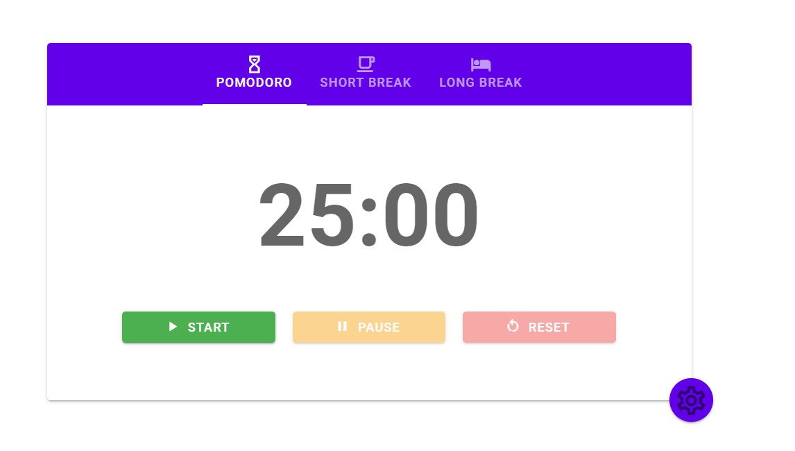
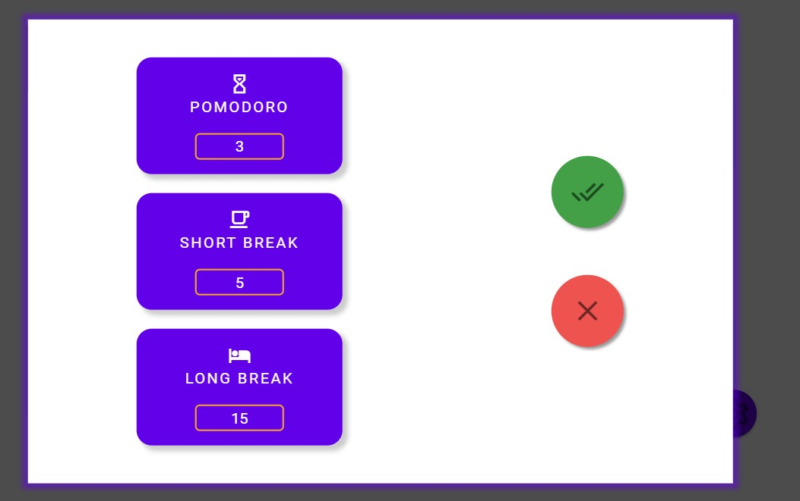

# pomodoro-vuetify




## 📋 Project Description

Pomodoro timer was created via Vue 2 and Vuetify. In this app you can see 3 bars:

- POMODORO: Timer for work;
- SHORT BREAK: Timer for taking breaks;
- LONG BREAK: Timer for taking long breaks;

📢 After time has reached 00:00 you can hear noisy sound, to stop it you just need to press on the "STOP" button.

❗ If you want to change time in any timers you should press on a cog in the right bottom corner. After that you can change time (positive numbers and integers), if you won't feet the requirments you will see UI friendly hints.

You can use it at any device such as mobile, desktop, laptop, etc. The smallest width to use is 250px;

I hope you enjoy it. If you have any problems or ideas feel free to contact me via:

- 📱 [Telegram] (@mackseam)
- 📧 [Gmail] (efremovmaxim95@gmail.com)

## 🚀 Build Setup

```
# install dependencies
npm install

# serve with hot reload at localhost:8080
$ npm run serve

```

### Compiles and minifies for production

```
npm run build
```

### Lints and fixes files

```
npm run lint
```

### Customize configuration

See [Configuration Reference](https://cli.vuejs.org/config/).
